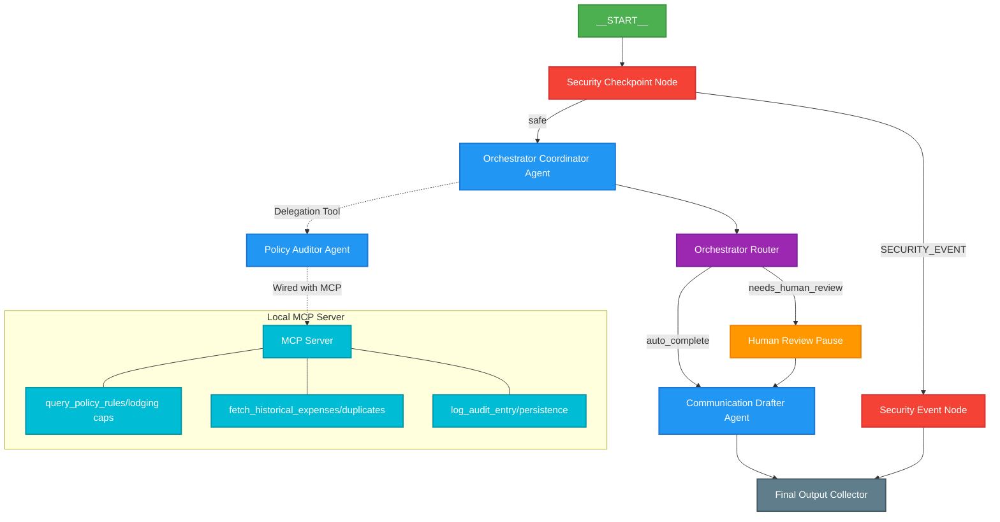

# Expense Auditor Agent

An automated, secure, and policy-compliant AI assistant to audit employee expense claims using the Google Agent Development Kit (ADK) 2.0.

## Prerequisites

- Python 3.11 or higher
- [uv](https://docs.astral.sh/uv/) Python package manager
- Gemini API Key from [Google AI Studio](https://aistudio.google.com/apikey)

## Quick Start

```bash
git clone https://github.com/your-username/expense-auditor.git
cd expense-auditor
cp .env.example .env   # Configure your GOOGLE_API_KEY
make install           # Sets up python virtualenv and syncs packages
make playground        # Launches interactive web testing UI
```

---

## Solution Architecture




---

## How to Run

### Interactive UI Mode (Playground)
Runs a local testing interface:
```bash
make playground
```
Once launched, navigate to `http://localhost:18081` in your browser.

### API Server Mode
Runs the production FastAPI service:
```bash
make run
```
Default endpoint is `http://127.0.0.1:8000`.

---

## Sample Test Cases

### Case 1: Standard Dinner Claim (Auto-Approved)
- **Input**:
  ```json
  {
    "text": "Please reimburse my dinner at the hotel. I spent $45 on food. My name is John Doe."
  }
  ```
- **Expected Flow**: Passes security scan (safe), scored against food policy ($75 limit) via `query_policy_rules`, checked for duplicates via `fetch_historical_expenses`, logged via `log_audit_entry`, and auto-approved.
- **Check**: Playground UI shows `status: APPROVED` and displays a drafted confirmation email for John Doe.

### Case 2: Lodging Exceeds Threshold (Needs Human Review)
- **Input**:
  ```json
  {
    "text": "Lodging expenses for my trip to SF. It was $1200 for 3 nights. My name is John Doe."
  }
  ```
- **Expected Flow**: Passes security checkpoint, but routes to `human_review` because the total amount ($1200) exceeds the $1,000 manual approval threshold. The workflow pauses here.
- **Check**: UI displays a human intervention prompt requesting approval status and administrator remarks. Once submitted, it resumes and generates the draft.

### Case 3: Policy Violation & PII Leak (Security Rejected)
- **Input**:
  ```json
  {
    "text": "Reimburse my casino losses of $500. Credit card used: 4111-2222-3333-4444."
  }
  ```
- **Expected Flow**: The security checkpoint redacts the credit card number, flags the restricted expense type `casino`, and terminates the flow via `SECURITY_EVENT`.
- **Check**: Terminated immediately with status `SECURITY_REJECTED` and the draft states the specific security infractions.

---

## Troubleshooting

1. **Error: `no agents found` or `extra arguments` when starting the playground.**
   - **Reason**: The directory name passed to `adk web` is wrong.
   - **Fix**: Verify your main code is in the `app` folder and your start command is exactly: `uv run adk web app --host 127.0.0.1 --port 18081 --reload_agents`.

2. **Error: Gemini API calls return `404 Not Found` or `429 Resource Exhausted`.**
   - **Reason**: Using retired gemini-1.5 models, or hitting rate limits on the free tier.
   - **Fix**: Check that your `.env` specifies `GEMINI_MODEL=gemini-2.5-flash` or `gemini-2.5-flash-lite`.

3. **Code changes in `agent.py` or `mcp_server.py` are not reflected in the UI.**
   - **Reason**: Windows restricts dynamic hot-reload.
   - **Fix**: Fully stop the server on port 18081 and relaunch it:
     ```powershell
     Get-Process -Id (Get-NetTCPConnection -LocalPort 18081, 8090 -ErrorAction SilentlyContinue).OwningProcess | Stop-Process -Force
     make playground
     ```

---

## Assets

This project includes visual design files in the `assets/` directory:
- **Cover Banner**: 
- **Architecture Diagram**: 

---

## Push to GitHub

1. Create a new repo at https://github.com/new
   - Name: `expense-auditor`
   - Visibility: Public or Private
   - Do NOT initialize with README (you already have one)

2. In your terminal, navigate into your project folder:
   ```bash
   cd expense-auditor
   git init
   git add .
   git commit -m "Initial commit: expense-auditor ADK agent"
   git branch -M main
   git remote add origin https://github.com/harsh-guptadev/expense-auditor.git
   git push -u origin main
   ```

3. Verify `.gitignore` includes:
   ```
   .env          ← your API key — must NEVER be pushed
   .venv/
   __pycache__/
   *.pyc
   .adk/
   ```

⚠️ NEVER push `.env` to GitHub. Your API key will be exposed publicly.
