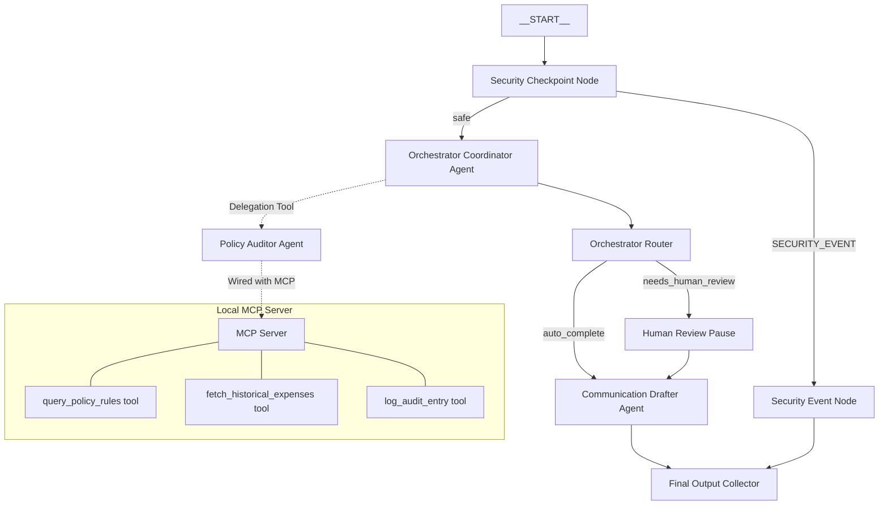

# Project Submission: Expense Auditor

## Problem Statement
Managing employee travel and entertainment expenses is a slow, error-prone process. Auditors must manually cross-reference claims against corporate lodging limits, food budgets, and transaction histories, leading to delays and compliance oversights. Furthermore, inputs could contain sensitive corporate details (PII) or prompt injection attacks designed to trick policy engines into auto-approving fraudulent claims. 

The **Expense Auditor** solves this by providing a secure, automated multi-agent workflow that filters inputs, verifies claims against policies, checks for anomalies, pauses for administrator review when thresholds are breached, and drafts compliant email communications.

---

## Solution Architecture

---

## Concepts Used

- **ADK 2.0 Workflow**: Managed in [app/agent.py](file:///c:/Users/HARSH/Desktop/adk-workspace/expense-auditor/app/agent.py), coordinating the nodes (`security_checkpoint`, `orchestrator`, `orchestrator_router`, `human_review`, `communication_drafter_node`, and `final_output`).
- **LlmAgent**: Used for the central `orchestrator`, `policy_auditor`, and `communication_drafter` in [app/agent.py](file:///c:/Users/HARSH/Desktop/adk-workspace/expense-auditor/app/agent.py).
- **AgentTool**: Declared on the `orchestrator` to enable delegation to the specialized `policy_auditor` and `communication_drafter` agents.
- **MCP Server**: Implemented in [app/mcp_server.py](file:///c:/Users/HARSH/Desktop/adk-workspace/expense-auditor/app/mcp_server.py) using the MCP Python SDK to expose live auditing tools.
- **Security Checkpoint**: Implemented in the `security_checkpoint` function node in [app/agent.py](file:///c:/Users/HARSH/Desktop/adk-workspace/expense-auditor/app/agent.py) to check for credit card numbers, SSN leakage, prompt injections, and prohibited expense items.
- **Agents CLI**: Scaffolding, environments, and testing targets are built using the `agents-cli` tool.

---

## Security Design

- **PII Scrubbing**: Regex filters automatically scrub 13-16 digit Credit Card numbers and standard US Social Security Numbers (SSN), replacing them with `[REDACTED_CREDIT_CARD]` and `[REDACTED_SSN]` before inputs reach the orchestrator.
- **Prompt Injection Detection**: Scans inputs for malicious override prompts (e.g. "ignore previous instructions") and reroutes them directly to a terminal rejection node, preventing LLM hijacking.
- **Audit Logging**: Emits JSON structured audit logs for every evaluation with severity levels (`INFO`, `WARNING`, `CRITICAL`), providing a reliable tamper-proof trail of security checks.
- **Domain Restrictions**: Implements a strict content filter checking for restricted expense items (e.g. `casino`, `gambling`, `bar tab`), ensuring bad claims are flagged before LLM scoring.

---

## MCP Server Design

Exposes three tools:
1. `query_policy_rules`: Retrieves lodging limits and allowances depending on the expense type (e.g. food limits, lodging caps in SF/NYC).
2. `fetch_historical_expenses`: Retrieves previous employee expense claims to check for double-submissions or historical anomalies.
3. `log_audit_entry`: Persists the audit decision (action taken and reason) into a system audit database.

---

## Human-in-the-Loop (HITL) Flow

A `RequestInput` node (`human_review`) is implemented to pause execution when:
- The total expense amount is $1,000 or greater.
- The policy auditor flags the claim as ambiguous or requiring manual review.

The workflow suspends, returns a schema-backed request to the administrator in the playground UI, and resumes execution only once a decision (approved/rejected + remarks) is submitted.

---

## Demo Walkthrough

- **Auto-Approval**: Inputting standard dinner claims (e.g. $45) automatically processes, logs the transaction, and produces an approval email.
- **Human Pause**: Inputting a large lodging request (e.g. $1,200) triggers a pause in the UI. The user approves it manually, yielding a finalized draft incorporating the admin's remarks.
- **Security rejection**: Inputting a query requesting reimbursement for gambling (containing credit card numbers) results in immediate rejection at the security boundary.

---

## Impact / Value Statement
By automating security auditing, policy matching, and duplicate verification, the Expense Auditor reduces claim processing cycles from days to seconds. Corporate finance teams benefit from 100% automated enforcement of travel thresholds while maintaining complete administrative oversight through human-in-the-loop review.
